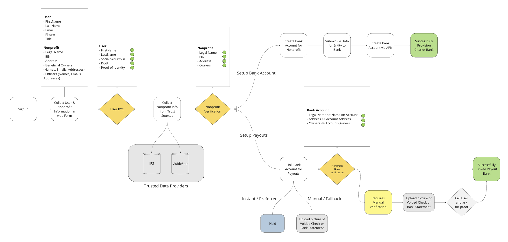
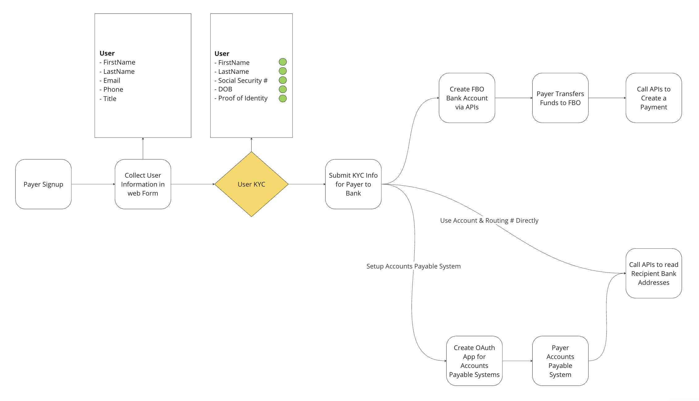

# Agapay

`Agapay` is the service that is responsible for Chariot Payments.

> `Agapay` is a play on the word `agape` which means "love" in Greek. It is a form of love that is selfless and unconditional.
It is the highest form of love that is given to others regardless of their merit.
It is a love that is sacrificial and giving. It is the love that God has for us.

## Overview

There are ~1.5M nonprofits in the US today that don't have an **easy** or **open** method
to accept electronic payments via any `open-network` payment method.

What if you could?

- pay any nonprofit
- instantly
- through the preferred payment method of the nonprofit
- attach data or documents to the payment
- have fraud and compliance checks done automatically
- and transparently track the payment through it's full lifecycle?

In a sense, that's exactly what `Agapay` does.

## How it works

## For the Recipients

Nonprofit entities are the recipients in the `Agapay` network.

To join the network, a nonprofit registers for a free account with `Chariot` and goes through a KYC process.
After they are approved and verified, they are given a bank account with a public-facing, non-sensitive
routing and account number.

This non-sensitive account and routing number is a valid `Agapay` address.

If a nonprofit acts as a fiscal sponsor for subsidiary organizations,
the `Agapay` network allows each subsidiary to exist as a separate recipient with their own `Agapay` address.

Additionally, the `Agapay` network allows for a single recipient to have multiple `Agapay` addresses
if they want to share certain addresses with specific groups of payers or for other reasons like accounting purposes.

Recipients can select their preferred payment method for each `Chariot` hosted `Agapay` address.



## For the Payers

Payers are the individuals or organizations that send payments to the recipients in the `Agapay` network.

To join the network, a payer registers for an account with `Chariot` and goes through a KYC process.
After they are approved and verified, they are given an FBO (For Benefit Of) bank account.

The payer then has 3 options to send payments to recipients:

1. **Send a payment via `Agapay` API to a recipient**
 In this flow, `Chariot` processes the request and pushes the payment from the payers FBO account to the recipient's account.
2. **Read the recipient's `Agapay` address via API and send a payment via their preferred payment method**
 In this flow, the payers read the non-sensitive account and routing numbers and create a payment intent
 for a payment that will be sent via the payers' preferred payment method.
3. **Delegate `Agapay` API access to Accounts Payable systems**
 In this flow, the payers delegate `Agapay` API access to their Accounts Payable systems via an OAuth application.
 The Accounts Payable systems can then read the recipient's `Agapay` address via API and send a payment via their preferred payment method.



## Getting Started

### Pre-requisites

- [NodeJS](https://nodejs.org/en/download/)
- [Yarn](https://yarnpkg.com/en/docs/install)
- [Docker](https://docs.docker.com/install/)
- [Golang](https://golang.org/doc/install)

### Build

Install project dependencies and build the project with the following command:

```bash
make
```

### Run tests

```bash
make test
```

### Configure environment variables

Copy the `.env.example` file to `.env` and update the values as needed.

```bash
cp .env.example .env
```

### Run locally

First run the following command to spin up the docker containers:

```bash
yarn docker:dev
```

Next, run the following command to initialize the database:

```bash
yarn db:init
```

### Call the API

```bash
curl -H "Authorization: Bearer chariot123" http://localhost:8088/recipients | jq .
```

```json
{
  "data": [
    {
      "id": "e8ff4be1-4603-4bb8-95f3-953c7b95882b",
      "name": "Chariot Giving Network",
      "ein": "931372175",
      "primary": true,
      "created_at": "2023-11-08T23:18:23.858Z"
    }
  ],
  "paging": {
    "cursors": {
      "after": "e8ff4be1-4603-4bb8-95f3-953c7b95882b"
    },
    "total": 1
  }
}
```
