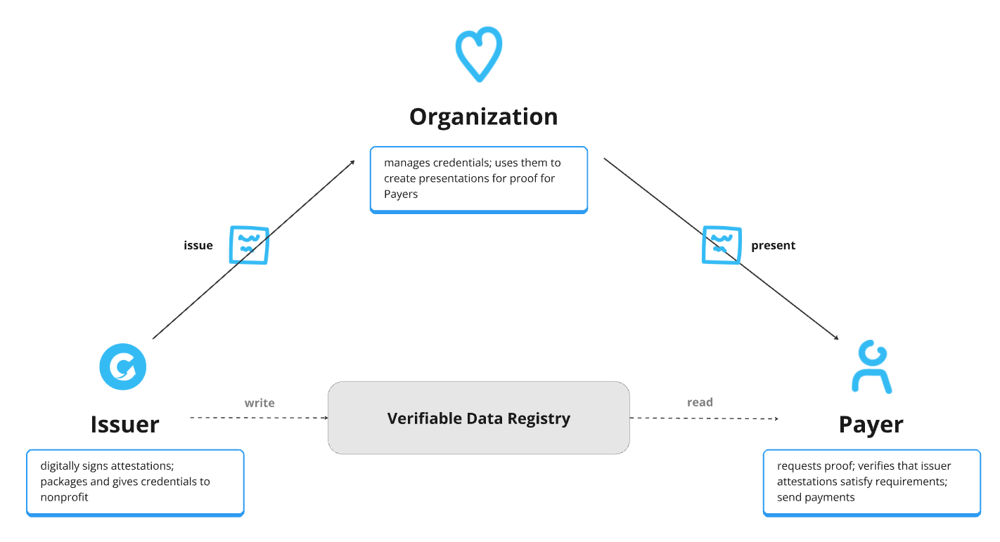

# Agapay

`Agapay` is an open network for charitable payments.

> `Agapay` is a play on the word `agape` which means "love" in Greek. It is a form of love that is selfless and unconditional.

## Overview

### The Problem

> There are ~1.5M nonprofits in the US today that don't have an **easy** or **open** method
to accept payments securely and reliably via any `open-network` electronic payment method.

> The IRS maintains a list of *most* tax-exempt organizations' physical addresses.
This database doesn't include many religious organizations, addresses are notoriously inaccurate,
and the best you can do is to mail a paper check and hope for the best.

> PayPal Giving Fund and PayPal Grant Payments offer convenience for charitable payments
for a significant cost and vendor lock to payers and with little regard for the nonprofit experience.

> Grantmakers aim to distribute funds to nonprofits in a secure, electronic, and cost-efficient manner.

> However, current practices require each grantmaker to independently establish and manage a system
for registering electronic payment information, presenting both technical and operational challenges.

> Today, these systems are a huge cost-center and resource drain for grantmakers to maintain compliance and up-to-date information
on all nonprofits within their systems.

> Grantmakers must revert to issuing checks when nonprofits are not present in their system.
Compounding the issue is the fact that every grantmaker is redundantly undertaking the same laborious technical and operational tasks.

> From the perspective of nonprofits, they are required to register with over 50 grantmaker portals to receive electronic payments.
This process involves managing numerous portals and logins, making the task of reconciling payments with their respective data exceedingly cumbersome.

### A New Approach

What if you could?

- pay any nonprofit organization
- instantly
- via your preferred payment rail
- without needing to maintain a database
- have fraud, compliance, and verification checks out of the box
- and attach data or documents to the payment

In a sense, that's exactly what `Agapay` does.



## Concepts

`Agapay` is a network for charitable payments.

### Entity

An `Entity` represents a tax-exempt (as defined by the IRS) nonprofit or a fiscal sponsor for a charitable organization.
An entity is a legal entity with a name, EIN (Federal Tax ID), officers, and a physical address.
There are approximately 1.5M nonprofits in the US.

## Organization

An `Organization` represents an operating entity or an operating sub-organization of a parent or sponsoring entity.
Organizations can receive payments from payers on the network.
Organizations are associated with a web domain, logo, and a set of verified addresses where they can receive payments.

## Address

A `Address` is a public-facing identifier that can be used to send payments to an `Organization`.
An Organization is said to be "addressable" if it has at least one `Address`.
An Address can take many forms depending on the type of payment rail used:

### Postal Address

A postal address is a mailing address where physical mail can be received.
Postal addresses are used to send paper checks.

### US Bank Account

A US bank account is a financial account that can be used to securely receive electronic payments.
A bank account address is usually composed of an account number and a routing number.
The routing number is the American Bankers' Association (ABA) Routing Transit Number (RTN).
The account number is an identifier specific to the receiving bank that uniquely identifies an account that can receive payments.
Bank account addresses (account and routing numbers) can be used to send ACH, RTP, wire transfers, and FedNow payments.

## Service Provider

A `Service Provider` is a 3rd-party organization that issues verifiable `Addresses` to nonprofit `Organizations`.
Chariot is the first `Service Provider` to offer `Addresses` to nonprofits.
This doesn't necessarily mean Chariot will be the only `Service Provider` in the network.

## Verifiable Credential

A `Verifiable Credential` or `VC` is a digital credential that is issued to an `Organization` by a `Service Provider`.
The `VC` proves authenticity and validity of an `Entity`, `Organization`, or `Address` and allows anyone to instantaneously verify the information presented.
For more information about `VC`s, see the [W3C Verifiable Credential specification](https://www.w3.org/TR/vc-data-model/).

## How it works

### For the Recipients

To join the network, an `Organization` works with a `Service Provider` (e.g. Chariot).
In order to onboard, the `Service Provider` needs to trust the nonprofit `Entity` and `Organization`.
The `Service Provider` will perform KYB/KYC checks on the `Entity` and `Organization` and issue them
public-facing `Addresses` along with `Verifiable Credentials` attesting to the authenticity of the `Entity`, `Organization`, and `Address`.

In Chariot's case, organizations are issued a `Chariot` bank account
with public-facing, non-sensitive routing and account numbers.

This non-sensitive account and routing number is a valid `US Bank Account Address`.

If a nonprofit entity acts as a fiscal sponsor for subsidiary organizations,
the `Agapay` network allows each subsidiary to exist as a separate `Organization` with their own `Address`.
Note that in this case, the parent entity is responsible for the financial obligations of the subsidiary entities
and therefore issuance of an `Address` is conditional upon the parent entity's approval (part of the KYB/KYC process).

Additionally, the `Agapay` network allows for a single `Organization` to have multiple `Addresses`
if they want to share certain addresses with specific groups of payers or for other reasons
like accounting purposes or fund designations.

Organizations can indicate their preferred `Address` to other payers in the network.

### For the Payers

Payers are the individuals or organizations that send payments to `Organizations` in the `Agapay` network.

While we envision a world where anyone could be a payer and use the network for free, we also recognize that would come with its own set of challenges.
Ultimately, an open network built upon `Verifiable Credentials` still operates in a "triangle of trust" between issuer (Chariot), holder (Nonprofit Organization), and verifier (Payer).
Note that because `Verifiable Credentials` can be created by anyone, the verifier (Payer) needs to decide if they trust the issuer.
For now, it's easier if the verifier has a direct relationship with the issuer (Chariot).

To join the network, a prospective payer registers for an account with `Chariot` and goes through an onboarding process.
After they are approved and verified, they are given API keys.
If we wanted to support end-to-end payment solutions, we would also set up a payment account (FBO) for the payer.

The payer then has 3 options to send payments to `Organizations`:

1. **Read the Organization's Address via API and send a payment via their preferred payment method**
 In this flow, the payers call the API to read the public-facing `Address` identifier
 and create a payment intent for a payment that will be sent via the appropriate payment rail.
 This option is ideal for payers that manage their own Accounts Payable systems or already have capabilities to send payments.
2. **Delegate `Chariot` API access to Accounts Payable systems**
 In this flow, the payers delegate `Chariot` API access to their Accounts Payable systems via an OAuth application.
 The Accounts Payable systems can then read the Organization's `Address` via API and send a payment via the appropriate payment network.
 Note that this method requires Chariot to offer OAuth and for charitable AP systems to have built an integration with the `Chariot` API.
3. **Use Chariot's hosted payment solution**
 In this flow, the payers use Chariot's hosted payment solution to send payments to the `Organizations`.
 This option is ideal for payers that do not want to manage their own Accounts Payable systems and/or want to offload the responsibility of sending payments altogether.
 In the future, `Chariot` could also offer our own Accounts Payable system that is integrated with the `Chariot` API.

## API Reference

### Authorization

The API accepts [Bearer Authentication](https://datatracker.ietf.org/doc/html/rfc6750).
When you sign up for a Chariot account, we make you a pair of API keys:
one for production and one for our sandbox environment in which no real money moves.
You can create and revoke API keys from the dashboard and should securely store them using a secret management system.

### OpenAPI

The `Chariot` API is documented using [OpenAPI](./spec/openapi.yaml).
This spec is in beta and subject to change. If you find it useful, or have feedback, let us know!

### Errors

The API uses standard HTTP response codes to indicate the success or failure of requests.
Codes in the 2xx range indicate success; codes in the 4xx and 5xx range indicate errors.
Error objects conform to [RFC 7807](https://datatracker.ietf.org/doc/html/rfc7807) and can be distinguished by their type attribute.
Errors will always have the same shape.

```json
{
  "status": 400,
  "type": "Bad Request",
  "title": "failed to create bank account",
  "detail": "your request contains invalid parameters: the name must be at least 3 characters long",
}
```

### Idempotency

The API supports idempotency for safely retrying requests without accidentally performing the same operation twice.
This is useful when an API call is disrupted in transit and you do not receive a response.
For example, if a request to create a payment does not respond due to a network connection error,
you can retry the request with the same idempotency key to guarantee that no more than one payment is created.

To perform an idempotent request, provide an additional, unique `Idempotency-Key` request header per intended request.
We recommend using a V4 UUID. Reusing the key in subsequent requests will return the same response code and body as
the original request along with an additional HTTP header (Idempotent-Replayed: true).
This applies to both success and error responses.
In situations where your request results in a validation error,
you'll need to update your request and retry with a new idempotency key.

Idempotency keys will persist in the API for at least 1 hour.
If an original request is still being processed when an idempotency key is reused, the API will return a
[409 Conflict](https://developer.mozilla.org/en-US/docs/Web/HTTP/Status/409) error.
Subsequent requests must be identical to the original request or the API will return a
[422 Unprocessable Entity](https://developer.mozilla.org/en-US/docs/Web/HTTP/Status/422) error.
We discourage setting an idempotency key on `GET` and `DELETE` requests as these requests are inherently idempotent.

## Proof of Concept

This repository includes a working proof of concept that demonstrates the full Agapay flow:

1. **Verifiable Credentials** -- W3C VC Data Model 2.0 with JWT-VC proof format (Ed25519)
2. **Decentralized Identifiers** -- `did:web` with CNAME-delegated hosting, `did:key` for individuals
3. **On-Chain Registry** -- Multi-chain nonprofit registry (Solana Anchor + Tempo Solidity)
4. **Privacy-Preserving Payments** -- ISO 20022-inspired messages with encrypted donor PII on IPFS
5. **Stablecoin Settlement** -- Multi-chain support: USDC on Solana (SPL Memo) or TIP-20 on Tempo (`transferWithMemo`)

### Quick Start (Simulated Demo)

```bash
# Run the simulated E2E demo (no external dependencies needed)
go run ./cmd/agapay demo
```

### Quick Start (Tempo Testnet)

The Tempo demo runs the full flow against real contracts on Tempo's Moderato testnet. No IPFS required (falls back to in-memory mock).

**Prerequisites:**

```bash
# Install Tempo's Foundry fork
curl -L https://foundry.paradigm.xyz | bash
foundryup -n tempo

# Create and fund a wallet
cast wallet new
cast rpc tempo_fundAddress 0x<YOUR_ADDRESS> --rpc-url https://rpc.moderato.tempo.xyz

# Deploy contracts (from repo root)
forge create contracts/tempo/src/AgapayRegistry.sol:AgapayRegistry \
  --tempo.fee-token 0x20c0000000000000000000000000000000000001 \
  --rpc-url https://rpc.moderato.tempo.xyz --private-key 0x<KEY> --broadcast --verify

forge create contracts/tempo/src/AgapayPaymentRouter.sol:AgapayPaymentRouter \
  --tempo.fee-token 0x20c0000000000000000000000000000000000001 \
  --rpc-url https://rpc.moderato.tempo.xyz --private-key 0x<KEY> --broadcast --verify
```

**Configure and run:**

```bash
# Save contract addresses and private key to config
go run ./cmd/agapay setup --chain tempo \
  --registry 0x<REGISTRY> --router 0x<ROUTER> \
  --token 0x20c0000000000000000000000000000000000001 \
  --private-key <HEX_KEY_WITHOUT_0x>

# Run the full E2E demo on Tempo testnet
go run ./cmd/agapay live --chain tempo

# Look up an organization on-chain
go run ./cmd/agapay lookup --ein 530196605
```

See [`contracts/tempo/README.md`](contracts/tempo/README.md) for the complete walkthrough including `cast`/`forge` commands.

### Quick Start (Solana Devnet)

The Solana demo runs the full flow against Solana devnet and a local IPFS node.

**Prerequisites (using [mise](https://mise.jdx.dev)):**

```bash
# Install mise if not already installed
curl https://mise.jdx.dev/install.sh | sh

# Install pinned tool versions (Go, Rust, Node.js)
mise install

# Install Solana CLI, Anchor CLI, and IPFS Kubo
mise run install-tools
```

**Deploy and run:**

```bash
# Start the local IPFS daemon (in a separate terminal)
ipfs daemon

# Build and deploy the Anchor program to devnet
mise run deploy

# Run the setup command (creates test mint, airdrops SOL, saves config)
go run ./cmd/agapay setup --program-id <PROGRAM_ID_FROM_DEPLOY>

# Run the live devnet demo
go run ./cmd/agapay live
```

### Other CLI Commands

```bash
# Issue credentials for a nonprofit
go run ./cmd/agapay issue --ein 530196605 --name "American Red Cross" --domain redcross.org

# Send a payment (simulated)
go run ./cmd/agapay pay --ein 530196605 --amount 50000 --donor-name "John Doe" --donor-email "john@example.com"
```

### Project Structure

```
agapay/
├── mise.toml                      # Reproducible dev environment (tools, env, tasks)
├── spec/                          # Specifications and schemas
│   ├── credentials/               # VC JSON-LD schemas (4 credential types)
│   ├── messages/                  # ISO 20022-inspired payment message schema + examples
│   └── protocol/                  # Protocol specification documents
├── contracts/                     # Smart contracts (multi-chain)
│   ├── tempo/                     # Tempo EVM contracts (Solidity / Foundry)
│   │   ├── src/                   # AgapayRegistry.sol, AgapayPaymentRouter.sol
│   │   ├── test/                  # Forge tests
│   │   └── script/                # Deployment scripts
│   └── solana/                    # Solana contracts (Anchor / Rust)
│       ├── programs/              # agapay-registry Anchor program
│       └── tests/                 # Anchor integration tests (TypeScript)
├── pkg/                           # Go library packages
│   ├── chain/                     # Chain-agnostic types (Address, TxHash, ChainID)
│   ├── did/                       # DID creation, resolution, CNAME hosting
│   ├── credential/                # VC issuance (JWT-VC) and verification
│   ├── message/                   # Payment messages with hybrid encryption
│   ├── ipfs/                      # IPFS client (real + mock) for encrypted data storage
│   ├── registry/                  # Registry interface + Solana/Tempo implementations
│   └── settlement/                # Settler interface + Solana/Tempo implementations
├── cmd/agapay/                    # CLI tool (demo, setup, live, issue, verify, pay, decrypt)
├── foundry.toml                   # Foundry config (Tempo fork)
├── go.mod                         # Go module
└── lib/                           # Foundry dependencies (forge-std)
```

### Key Design Decisions

1. **DID Hosting via CNAME**: Nonprofits add one DNS record (`agapay.redcross.org CNAME dids.givechariot.com`) and get a fully functional `did:web` identity without running any infrastructure. Self-sovereignty preserved: they can revoke the CNAME and self-host at any time.

2. **Privacy-Preserving Payments**: On-chain data is limited to amounts, payment types, and IPFS CIDs. All PII (donor names, emails, addresses, fund details) is encrypted to the recipient's X25519 public key and stored on IPFS. The on-chain hash allows tamper verification.

3. **ISO 20022 Alignment**: The `AgapayPaymentInstruction` format maps to ISO 20022 concepts (`pain.001`) but uses JSON and is tailored for charitable payments (DAF grants, corporate matches, QCDs).

4. **Separation of Concerns**: Identity (VCs + DIDs), registry (Solana), data (IPFS), and settlement (USDC) are independent layers that can be swapped independently.

### Running Tests

```bash
# Go unit tests (DID, credential, message encrypt/decrypt, IPFS)
go test ./...

# Tempo contract tests (Foundry)
forge test -vvv

# Solana program tests (requires Anchor and local validator)
cd contracts/solana && anchor test
```

---

## Future Roadmap & Strategy

The vision for this project is to create a truly open database and network for payments to nonprofits.

As part of this vision, we need to differentiate it from existing payment networks and databases, e.g. PayPal.

### What's needed?

#### Digital Credentials

The `Verifiable Credentials` model places the holder (Nonprofit Organization) at the center of the identity system
and giving them control over their identity and data.

The trust model is more "decentralized" and allows for a more open and competitive marketplace of identity solutions.

Service Providers can issue `Verifiable Credentials` to `Entities`, `Organizations` and `Addresses`.

`Verifiable Credentials` make the information in the database instantly verifiable and tamper-resistent.

#### Database

At the crux of an `open` network is the database of `Organizations` and their `Addresses`.

We believe this database should be completely public and free.

Organizations should retain self-sovereignty over the data in the database.

The database itself enforces consistency and validity through a distributed consensus model.

There exists a contract between the network Service Providers and the database that ensures
data records are valid Addresses.

#### Settlement Layer

The actual settlement layer is decoupled from the database of `Addresses`.

`Addresses` are simply pointers to real-world identifiers in a payment network's settlement layer.

This allows the `Agapay` network to service a variety of different settlement layers including
over the Federal Reserve's RTP network, ACH, and card networks as well as utilizing
decentralized, blockchain-based networks like on-chain wallets, stablecoins and cryptocurrencies in the future.

### Differentiation

- **Open Network** - Any `Organization` can join and receive payments.
- **Open Database** - The database is public and free.
- **Self Sovereignty** - `Organizations` own their own `Addresses` and can move freely between network service providers or even be their own network service provider.
- **Network Agnostic** - `Addresses` can be used with any `open-network` payment network which encourages competition and drives down network costs for the benefit of participants.
- **Competition** - Network `Service Providers` can compete on price and features which will drive down costs and increase innovation which has positive reinforcement feedback for the network itself.
