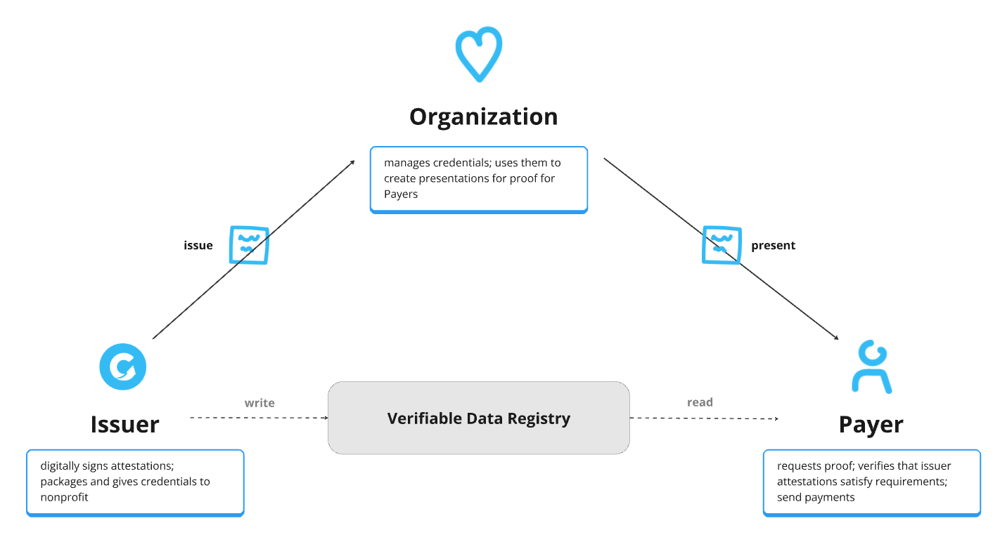

# Agapay

`Agapay` is an open network for charitable payments.

> `Agapay` is a play on the word `agape` which means "love" in Greek. It is a form of love that is selfless and unconditional.

## Overview

### The Problem

> There are ~1.5M nonprofits in the US today that don't have an **easy** or **open** method
to accept payments securely and reliably via any `open-network` electronic payment method.

> The IRS maintains a list of *most* tax-exempt organizations' physical addresses.
This database doesn't include many religious organizations, addresses are notoriously inaccurate,
and the best you can do is to mail a paper check and hope for the best.

> PayPal Giving Fund and PayPal Grant Payments offer convenience for charitable payments
for a significant cost and vendor lock to payers and with little regard for the nonprofit experience.

> Grantmakers aim to distribute funds to nonprofits in a secure, electronic, and cost-efficient manner.

> However, current practices require each grantmaker to independently establish and manage a system
for registering electronic payment information, presenting both technical and operational challenges.

> Today, these systems are a huge cost-center and resource drain for grantmakers to maintain compliance and up-to-date information
on all nonprofits within their systems.

> Grantmakers must revert to issuing checks when nonprofits are not present in their system.
Compounding the issue is the fact that every grantmaker is redundantly undertaking the same laborious technical and operational tasks.

> From the perspective of nonprofits, they are required to register with over 50 grantmaker portals to receive electronic payments.
This process involves managing numerous portals and logins, making the task of reconciling payments with their respective data exceedingly cumbersome.

### A New Approach

What if you could?

- pay any nonprofit organization
- instantly
- via your preferred payment rail
- without needing to maintain a database
- have fraud, compliance, and verification checks out of the box
- and attach data or documents to the payment

In a sense, that's exactly what `Agapay` does.

