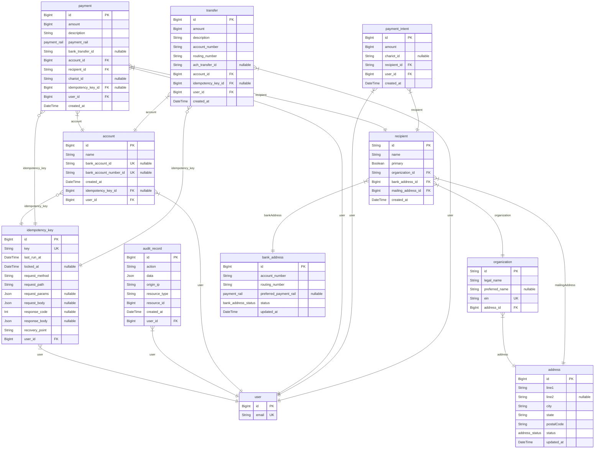

# Chariot Payments
> Generated by [`prisma-markdown`](https://github.com/samchon/prisma-markdown)

- [default](#default)

## default

### `user`

**Properties**
  - `id`: 
  - `email`: 

### `idempotency_key`

**Properties**
  - `id`: 
  - `key`: 
  - `last_run_at`: 
  - `locked_at`: 
  - `request_method`: 
  - `request_path`: 
  - `request_params`: 
  - `request_body`: 
  - `response_code`: 
  - `response_body`: 
  - `recovery_point`: 
  - `user_id`: 

### `audit_record`

**Properties**
  - `id`: 
  - `action`: 
  - `data`: 
  - `origin_ip`: 
  - `resource_type`: 
  - `resource_id`: 
  - `created_at`: 
  - `user_id`: 

### `account`

**Properties**
  - `id`: 
  - `name`: 
  - `bank_account_id`: 
  - `bank_account_number_id`: 
  - `created_at`: 
  - `idempotency_key_id`: 
  - `user_id`: 

### `organization`

**Properties**
  - `id`: 
  - `legal_name`: 
  - `preferred_name`: 
  - `ein`: 
  - `address_id`: 

### `recipient`

**Properties**
  - `id`: 
  - `name`: 
  - `primary`: 
  - `organization_id`: 
  - `bank_address_id`: 
  - `mailing_address_id`: 
  - `created_at`: 

### `payment`

**Properties**
  - `id`: 
  - `amount`: 
  - `description`: 
  - `payment_rail`: 
  - `bank_transfer_id`: 
  - `account_id`: 
  - `recipient_id`: 
  - `chariot_id`: 
  - `idempotency_key_id`: 
  - `user_id`: 
  - `created_at`: 

### `payment_intent`

**Properties**
  - `id`: 
  - `amount`: 
  - `chariot_id`: 
  - `recipient_id`: 
  - `user_id`: 
  - `created_at`: 

### `transfer`

**Properties**
  - `id`: 
  - `amount`: 
  - `description`: 
  - `account_number`: 
  - `routing_number`: 
  - `ach_transfer_id`: 
  - `account_id`: 
  - `idempotency_key_id`: 
  - `user_id`: 
  - `created_at`: 

### `address`

**Properties**
  - `id`: 
  - `line1`: 
  - `line2`: 
  - `city`: 
  - `state`: 
  - `postalCode`: 
  - `status`: 
  - `updated_at`: 

### `bank_address`

**Properties**
  - `id`: 
  - `account_number`: 
  - `routing_number`: 
  - `preferred_payment_rail`: 
  - `status`: 
  - `updated_at`: 